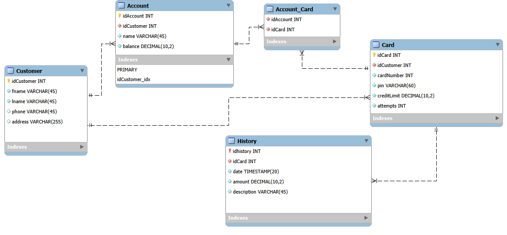

# ATM Project Group_5

## Description

The project is about learning how to create a working ATM, allowing users to perform basic banking operations.

The ATM is operated with an RFID-card reader attached to the computer's serial port. The work utilizes RFID cards that communicate with the reader.

A REST-API solution is used for data transfer, which is intended to make the application and database work together, including customer data management.

## Utilization of technology

The ATM program is built as a Qt/C++ desktop application, from which data is transferred to a MySQL database through the REST API.

The tools utilized in the work are Qt Creator, Visual Studio Code, Lucidchart, MySQL Workbench and GitHub. These tools make up the development environment.

## Database


## Prerequisites

- Node.js
- MySQL
- Qt Creator

## Using the application

To use the application, create an .env file, in which you fill in the information from the database according to the template.
```env
DB_HOST=34.88.250.226
DB_PORT=3306
DB_USER=Group_05
DB_PASSWORD=??
DB_DATABASE=bank
```